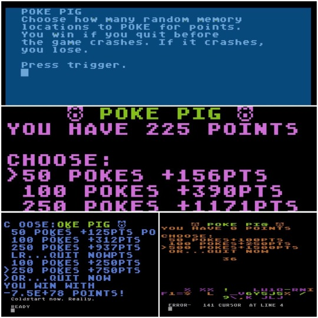

# 10line-PokePig2
Poke Pig game in Turbo BASIC XL for Atari 8-bit. Entry for 2020 10-line BASIC contest.

I first submitted it in 2019, but with a bug that made it unplayable, so resubmitted as Poke Pig 2.0 in 2020.

My third grade teacher hated me and told my mom that I would grow up to be a serial killer. (This turned out to be inaccurate.) She also taught me the dice game “Pig.” In our class, the teacher would roll two dice again and again. Students would add each dice roll to their score, and could quit at any time. But if the teacher rolled snake eyes, the game was over, and any students still playing were out with zero points.

This 10-line BASIC contest entry is loosely based on the Pig game. It is a ridiculous self-modifying program — instead of rolling dice, it pokes random numbers into random memory locations owned by BASIC. The player can choose how many random memory locations to POKE for points. The player wins if they quit before the game crashes.

I doubt the judges will like it, but I think it’s hilarious. It fits into the Pure-120 character category.
